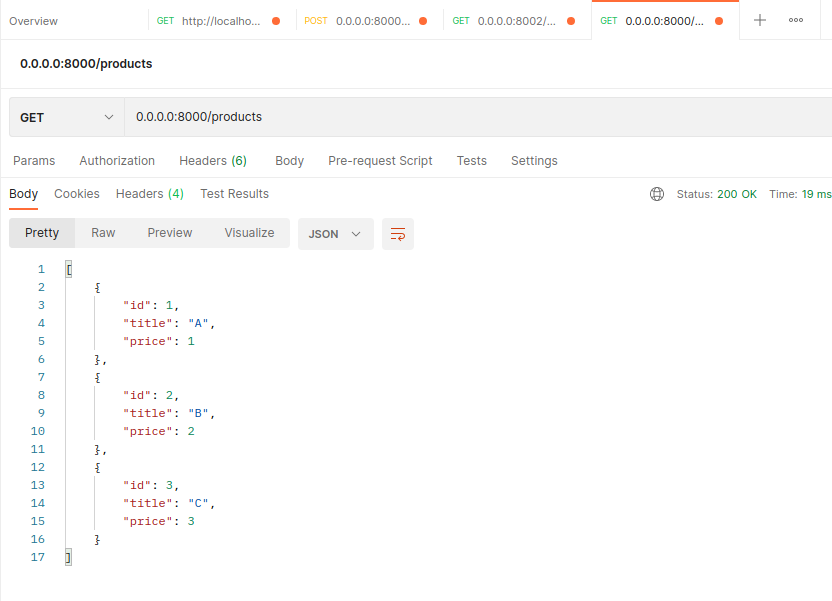

# Golang microservices 

Пример интернет-магазина на микросервисах. Состоит из:
* **Registry (:8000)**  - сервис регистрации заказов, знает про список товаров, является входной точкой для всего сервиса
* **Wallet (:8001)** - сервис оплаты, кошелек пользователя, регистрирует транзакции оплаты
* **Storage (:8002)** - сервис резервирования товаров на складе

## Запуск
* По необходимости настроить **.env** файл
* По необходимости настроить **config.yaml** каждого микросервиса
* Сделать ```docker-compose -f docker-compose.yml up```
* После запуска для каждого сервиса доступен сваггер: **0.0.0.0:<SERVICE_PORT>/swagger/


## Доступные эндпоинты: 
* **0.0.0.0:8000/orders/** [POST] - создание заказа
* **0.0.0.0:8000/orders?user_id=<id>** [GET] - список заказов
* **0.0.0.0:8000/products/** [GET] - список продуктов (чтобы узнать айдишники, передлывать на sku мне лень)
* **0.0.0.0:<SERVICE_PORT>/health(?timeout=<seconds>)** [GET] - healthcheck для каждого сервиса
* **0.0.0.0:<SERVICE_PORT>/swagger/** - сваггер для каждого сервиса

## Пара скринов:





## Пару слов по архитектуре:
Сервисы общаются через кафку, в роли координатора - сервис Registry, ввсего 3 топика:
- **new_orders** - прилетают новые заказы, сюда пишет только Registry
- **rejected_orders** - прилетают отклоненные заказы, сюда пишут и читают все сервисы
- **success_topics** - прилетают сообщения об успешных действиях, сюда пишут только Wallet и Storage, а читает только Registry

О новых заказах Registry оповещает другие сервисы через new_orders, заказ помечается как Pending. 
Далее, registry ожидает сообщения и rejected_orders и success_topics.
При ошибке на каждом сервисе они сообщают в rejected_orders, другие - читают и откатывают совершенные ранее действия.
При успехе каждый сервис пишет в success_topics, Registry - его читает и меняет статус заказа.